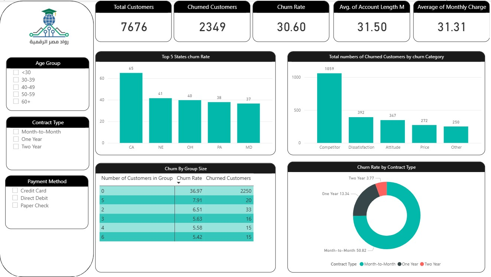
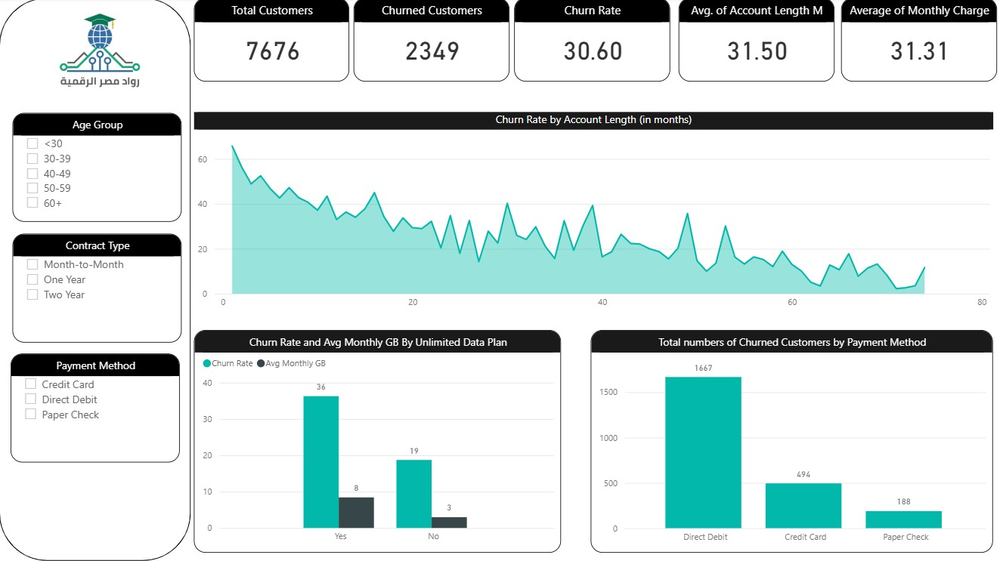

# Telco (skylink)Customer Churn Multi-Page Analytics Dashboard

## 📊 Page 1: Overview

## 📈 Page 2: Trends Analysis  

**4-page interactive dashboard analyzing 7,676 customers (2,349 churned, 30.6% rate) with churn drivers across age groups, payment methods, tenure, CSAT, and extra data plans.**

## 📊 Key Findings
| Driver | Churn Rate |
|--------|------------|
| **Paper Check** | **57%** |
| **Monthly Contract** | **High risk** |
| **Low CSAT** | **55% churn** |

## 🛠️ Tech Stack
- **Power BI** | Multi-page storytelling | Churn segmentation

## 🚀 Quick Start
1. Download `Telco-Churn-MultiPage.pbix`
2. Open in **Power BI Desktop**
3. Navigate 4 pages for deep insights!

## 📞 Contact
Have questions about the dashboard or want to collaborate?  
**Email**: Abdelrahman.Gamal.Ai@gmail.com | **LinkedIn**: [linkedin.com/in/yourprofile](https://www.linkedin.com/in/abdelrahman-gamal236/) | **whatsapp**: +201029744194

---
⭐ Star if helpful! 👨‍💻 Built by **[Abdelrahman Gamal]**
